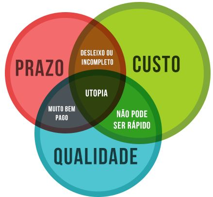
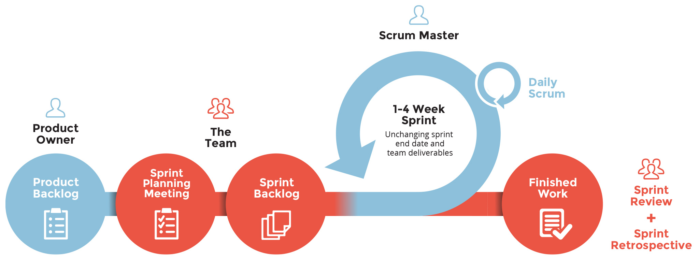
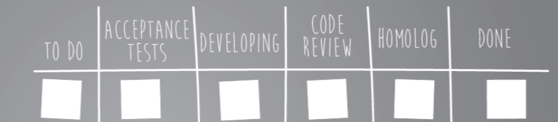
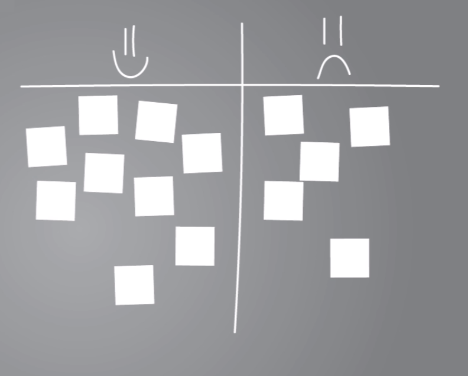
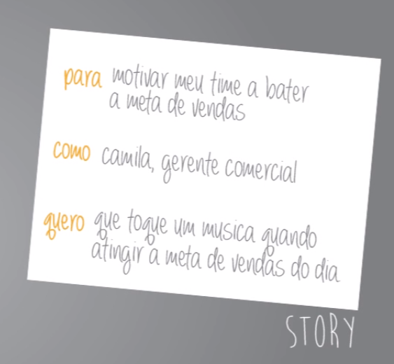
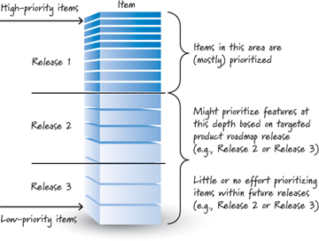

<!-- $theme: gaia -->
<!-- template: invert -->

# ==Scrum==
## Introdução ao framework
##### `Ruhan de Oliveira Baiense`
###### arcoinformatica.com.br

---

# Introdução aos Métodos Ágeis

[Um pouco da história](https://cursos.alura.com.br/course/introducao-aos-metodos-ageis/task/3877)
[Apresentando Scrum, Kanban e XP](https://cursos.alura.com.br/course/introducao-aos-metodos-ageis/task/3884)

- Agile é uma filosofia a ser seguida.
- Métodos ágeis focam em pouca documentação, e mais produtividade.

---

# Manifesto Ágil

- ==Indivíduos e interações== mais que processos e ferramentas
- ==Software em funcionamento== mais que documentação abrangente
- ==Colaboração com o cliente== mais que negociação de contratos
- ==Responder a mudanças== mais que seguir um plano

>_...mesmo havendo valor nos itens à direita, valorizamos mais os itens à esquerda._

---

# Genrênciamento de Projeto

---

# História do Scrum

- O termo "Scrum" foi cunhado por **Takeuchi** e **Nonaka** em alusão à formação do Rugby, em que todo o time está junto buscando a posse da bola;
- Para Scrum, o conceito de time é extremamente importante;
- A metáfora que utiliza o Rugby ainda se relaciona ao conceito de ==sprint==, que é quando o time rouba a bola e o jogador deve correr rapidamente com ela, e esse processo se repete até a conclusao do jogo.

[Exemplo de um Scrum no Rugby](https://youtu.be/Y5qLMDHC7sg?t=46)

---

# O que é Scrum?

- O Scrum é um framework ágil de gerenciamento de projetos.
- Sua principal característica é trabalhar com ==time-boxes==: caixas de tempo com capacidade definida, rígida e não negociável.
- Uma vez definidas as durações das time-boxes, elas não mudam durante o Sprint atual.

---

# Sprints

- A **Sprint** é o tempo que temos para agregar valor e marcar pontos no projeto.
- Para delimitar o tamanho da Sprint vários fatores devem ser levados em consideração. A duração da Sprint atual não pode ser alterada. No entanto, ao final de um ciclo, ela pode ser revista.
- O Sprint é formado por varias etapas: Planning Meeting, Desenvolvimento, Daily Scrum, Review Meeting e Retrospective.

---

# Sprint Life Cycle

---

# Planning Meeting

- É uma reunião de planejamento que reúne a equipe inteira.
- Entramos nela com uma lista de todos os afazeres (Product Backlog) e saímos com outra, de tarefas específicas a serem concluídas (Sprint Backlog).
- Duraçã de 5% do tamanho do Sprint, pra 1 semana de Sprint, teremos `2 horas` de planejamento.
- O **P.O.** deve ter passado um tempo considerável pegando o topo do Backlog, os itens mais importantes, e refinando-os, se necessário em contato com os membros do time.

---
# Como realizar a Planning Meeting

- O P.O. chega com o Product Backlog, e apresenta os itens de maior prioridade para o cliente.
- Os desenvolvedores vão discutir sobre o item, estimar quanto de esforço deve ser empregado nesse tipo de tarefa.
- Na próxima parte da reunião, é feita a negociação daquilo que realmente cabe na Sprint.
- Objetivo é não sobrecarregar o time.
- Definir uma ==Meta== para o Sprint.
---

# Daily Scrum
- Reunião diária e rápida de no máximo `15 minutos` no próprio ambiente de trabalho, sempre no mesmo horário.
- Três perguntas principais devem ser respondidas: O que fez? O que fará? Quais problemas enfrentou?
- Toda a equipe deve participar.

---

# Review Meeting

- É o momento no qual o cliente e o time de desenvolvimento se reúnem para mostrar os incrementos feitos na Sprint.
- É uma time box que não deve ultrapassar `2.5%` tempo total da Sprint. Para um Sprint de 1 semana, o Review Meeting terá ==1 hora== de duração.
- Aprensetar os itens prontos para o cliente testar.
- Coletar o feedback e se necessário inserir no Product Backlog.
- Validar se a meta do Sprint foi atendida ou não.

---

## Definição de pronto

- A definição de ==pronto== tem que estar clara e bem definida.
- Sequência de passos a serem seguidos, para que possa considerar um item (task) pronto.
- Exemplo: Desenvolvido -> Testado -> Aprovado pelo ==cliente==.
- Não deve ser um critério muito grande.

---

### Exemplo de quadro de acompanhamento

---

## Retrospective

- Esta reunião fornece a possibilidade de melhoria contínua em que pode-se "lavar roupa suja" para nos reinventarmos para uma próxima Sprint.
- A cada 1 semana de Sprint, recomenda-se ==2 horas== de retrospectiva.
- É um momento de melhoria contínua, não um momento de apontar culpados.
- Esta reunião gera ==ações== que devem ser tomadas para solucinar os problemas.
- Deixar o resultado desta reunião visivel para o time, e valida-lo na proxima retrospectiva.

---

> Não importa o que descobriremos nessa reunião,
consideraremos que as pessoas agiram dessa
forma devido aos conhecimentos que possuíam
na época, tempo e recursos disponíveis.
Considerando esses aspectos, as pessoas zeram
seu melhor, e agora devemos seguir adiante.
>
> -- _==Prime Directive==_
> 

---

## Como executar uma Retrospetive

- Levantar os pontos positivos e negativos do Sprint.
- Agrupar esses pontos por assunto para facilitar a discução.
- Identificar com o time quais ações podem ser tomadas para solucinar o problema levantado.
- Sair da reunião de restropectiva com pelo menos ==1 ação== de melhoria definida.

---

### Exemplo de quadro de retrospectiva

---

## Histórias

- A história é um item que agrega valor ao usuário, escrita de forma bem diferente ao caso de uso, deve ter um ==título==, um ==porquê== , ==para quem== esse item é importante e ==obetivo== da história.
- Uma história faz parte do Product Backlog, mas no momento de desenvolvê-la, vamos paralelizar os ==sub-itens da história==, chamados de tarefa, `task`, para terminá-las o mais rápido possível.
- Quem possui maiores informações sobre a história é o P.O.

---

## Características de boas histórias

- Indepêndencia: máximo de indepêndencia possível entre as histórias.
- Negociáveis: O que não for negociável deve estar explícito.
- Valiosas: específicar bem o valor de cada hisória.
- Estimáveis: detalhadas o suficiente para serem estimaveis (custo benefício).
- Pequenas: que caibam em 1 Sprint, histórias grandes podem ser divididas em menores.
- Testaveis: critérios de aceitação explícitos.

---

### Exemplo de História

---

## Product Backlog e Sprint Backlog

[O que é Product e Sprint Backlog](https://cursos.alura.com.br/course/agile-scrum/task/10107)

- O _**Product Backlog**_ é a lista priorizada das histórias que agregam valor para o cliente. São histórias que envolvem o projeto inteiro. Somente o P.O. mexe nele, mas todo o time pode palpitar;
- O _**Sprint Backlog**_ engloba histórias e tarefas que estão no topo das prioridades. No Sprint Backlog o time altera essas tarefas sem que o cliente palpite sobre elas.

---
## ==DEEP==: Detailed appropriately, estimated, emergent, and prioritized

---

## Papéis no Scrum

- ==**Scrum Master**==
- ==**Product Owner**==
- ==**Desenvolvedores**==

---

# Scrum Master

[Quem é o Scrum Master](https://cursos.alura.com.br/course/agile-scrum/task/10115)
[Impedimentos](https://cursos.alura.com.br/course/agile-scrum/task/10116)

- O papel do Scrum Master é facilitar o ensino sobre o que é o Scrum e as responsabilidades de cada uma das partes envolvidas.
- Não se trata de ser necessariamente o chefe, mas sim um líder servidor, aquele que está disponível para ajudar e facilitar a comunicação.
- Sua terceira função é resolver impedimentos.

---

# Product Owner

[Quem é o Product Owner](https://cursos.alura.com.br/course/agile-scrum/task/10121)
[Como agir](https://cursos.alura.com.br/course/agile-scrum/task/10122)

- Responder dúvidas dos desenvolvedores sobre histórias ou indicar quem poderia respondê-las melhor;
- Deixar claro para o time qual o valor de negócios de cada Sprint;
- Manter o ==Product Backlog== atualizado;
- ==**Uma pessoa, não um comitê.**==

---

# Desenvolvedores

[Quem são os Desenvolvedores](https://cursos.alura.com.br/course/agile-scrum/task/10128)

- Desenvolvedor é aquele que ajuda a executar o projeto e o faz andar para a frente;
- O time de desenvolvimento que estima trabalho e tempo necessários;
- Os desenvolvedores também decidem o quanto de trabalho pode ser feito em um time-box. Não é uma pessoa externa que define tempo, são os próprios envolvidos no trabalho

---

# Melhoria contínua

[Como melhorar?](https://cursos.alura.com.br/course/agile-scrum/task/10147)

- Sempre aplicar as ações retiradas da retrospectivas e resolver os problemas à medida em que eles aparecem;
- A melhoria contínua é essencial;
- Todos devem pensar em melhorar constantemente, em conjunto;